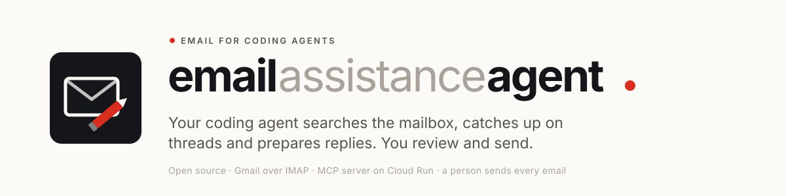

<picture>
  <source media="(prefers-color-scheme: dark)" srcset="docs/assets/banner-dark.svg">
  
</picture>

[](https://github.com/danielvogler/email-assistance-agent/actions/workflows/ci.yml)
[](./LICENSE)
[](https://www.python.org/downloads/)
[](https://docs.astral.sh/uv/)
[](https://docs.astral.sh/ruff/)
[](https://mypy-lang.org/)
[](https://pre-commit.com/)
[](https://github.com/gitleaks/gitleaks)
[](https://modelcontextprotocol.io)
[](https://opentofu.org)

**Ask your coding agent to find that thread, catch you up on it, and write the
reply. It lands in Gmail, in the right conversation, ready for you to send.**

---

## Start here

Point your coding agent at **[AGENTS.md](./AGENTS.md)** and tell it which
mailbox to set up:

```
Read https://github.com/danielvogler/email-assistance-agent/blob/main/AGENTS.md
and set this up for my Google Workspace mailbox. Only let it read the Inbox and
the "Clients" label, and nothing older than 90 days.
```

That file is the runbook: what to install, the decisions to make first, the
templates to copy into your own private repository, the deployment, and the
checks that must pass before anyone relies on it. You do not need to know
anything about the tool to start.

---

## What it does

**email assistance agent gives a coding agent your mailbox.** It can search
it, read messages and whole conversations, and prepare replies. A reply arrives
in Gmail inside the original conversation, addressed to the right people, with
the original quoted and your signature below. You read it, change what needs
changing, and press send.

<picture>
  <source media="(prefers-color-scheme: dark)" srcset="docs/assets/how-it-works-dark.svg">
  
</picture>

It is an [MCP](https://modelcontextprotocol.io) server with nine tools:

| Tool | What it does |
|---|---|
| `search` | Gmail search syntax (`from:acme newer_than:7d`), newest matches first |
| `read_message` | One message: headers and body |
| `read_thread` | The whole conversation, oldest first |
| `list_drafts` | Drafts it has prepared |
| `read_draft` | One of its drafts, so it can change it without losing text |
| `create_draft` | A reply in the original conversation, waiting for you in Gmail |
| `compose_draft` | A new email to the addresses you name, waiting for you in Gmail |
| `update_draft` | Changes a draft it created, keeping recipients and thread, so revisions don't pile up |
| `delete_draft` | Deletes a draft it created; nothing else can be deleted |

## You stay in control

The agent prepares; a person sends. That is enforced by how it is deployed,
not only by what the code happens to do:

- **It has no way to send.** It signs in with a Gmail app password, which
  cannot use the Gmail API, and its network blocks the ports mail is sent over.
  A check job in the deployment proves both are blocked.
- **Nobody holds the password.** It lives in Secret Manager, readable only by
  the service itself. The mailbox owner can store a new one but cannot read one
  back.
- **Replies go back to the right people.** For a reply, recipients, subject
  and threading come from the email being answered, so no email can redirect
  it. For a new email the agent uses the addresses you gave it, and either way
  you see the recipients before you send.
- **It reads only what you allow:** the labels (`INBOX`, `SENT`, `STARRED`,
  `IMPORTANT` or your own) and the time window you choose.
  Anything else behaves as if it did not exist, and so do your own unsent
  drafts. Reading never marks mail as read.
- **Email is treated as untrusted.** Every message comes back labelled as
  third-party content, so an email cannot instruct the agent reading it.

[SECURITY.md](./SECURITY.md) has the full picture, including what to do if an
app password ever leaks.

## Run it locally

For development, against a throwaway test mailbox, never a real one:

```bash
make setup
cp .env.example .env     # fill in EMAIL_USER and EMAIL_PASSWORD (an app password)
make run                 # serves MCP at http://localhost:8080/mcp
claude mcp add --transport http email-assistance-agent-dev http://localhost:8080/mcp
```

Locally nothing blocks outgoing mail ports; the guarantees above come from the
deployment.

## Deploy

Everything needed is in this repository: the container, the OpenTofu for every
Google Cloud resource, and the checks. Your own values (project, mailboxes,
state bucket) stay in a private repository of yours. [AGENTS.md](./AGENTS.md)
walks through it step by step, and several people can each have their own
mailbox in one deployment.

## Development

```bash
make check    # lint, type check, tests and infrastructure tests, exactly as CI runs them
make help     # every other target
```

The layout, conventions and the rules for adding a tool are in
[AGENTS.md](./AGENTS.md).

## License

[Apache-2.0](./LICENSE)
